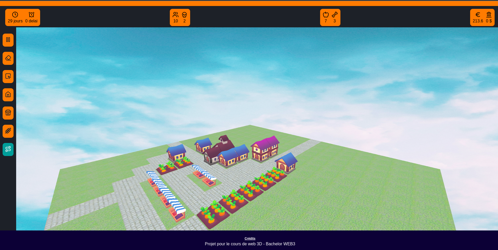

# Anoria

<p align="center">
  
</p>


## Installation locale


### Imports des packages
````
npm install
````

### Lancement du jeu
```
npm run dev
```

Se rendre ensuite sur localhost:5558

Il y a aussi une version en ligne : voir sur ce repo en haut à droite.

### Le Projet 

Je m'initie avec ce projet au en web 3D via Three JS. 

Ce projet est un mini jeu de construction de ville inspiré des jeux qui ont bercés mon adolescence tel que César 3, Pharaon, Sim City 3000, Civilisation III ....

Il a des fonctionnalités minimale afin d'avoir un premier gameplay. Il aurait été plus étoffé s'il avait été fait sur un moteur de jeu. Mais avec Three Js je me suis lancé un défi. 

J'ai donc appris à placer des objets 3D au milieu d'un site fonctionnant sur un browser. On peux trés bien imaginer ici que je pourrais transférer ces compétences pour, par exemple, créer des produits en 3D sur un site e-commerce. 

Ce que j'ai appris : 
- Monter les lumières 
- Créer la bonne caméra
- Importer des fichier GLB (avec un loader gltf) en asynchrone
- Travailler mes objets 3D
- Usage de Blender pour quelques ajustements et le format fbx > glb

J'utilise les librairies lowpoly gratuite de sketchFab. Une page de crédit est en cours d'inté.

### Gameplay 

Le gameplay est volontairement minimaliste pour cette version bêta. Une tel jeu gagnerait à être plutôt intégrer sur un moteur de jeu s'il devait évoluer avec un gameplay complexe et de meilleurs performances graphiques.

Ce que l'on peux faire à ce stade :
- Placer des bâtiments 
- Voir ce qu'ils ont comme impact sur la population, la nourriture et l'argent
- Des pages gameover sont déclenchés si vous dépassez un certain niveau de dette ($$) ou s'il y a trop de morts.
- Un personnage pourrait apparaître si certaines conditions sont réunies.
