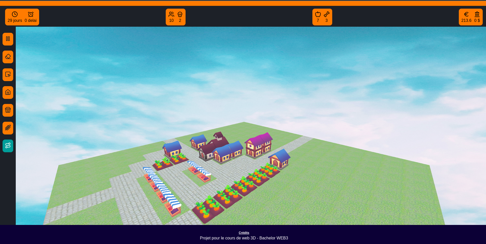

# Anoria

<p align="center">
  
</p>


## Installation locale


### Imports des packages
````
npm install
````

### Lancement du jeu
```
npm run dev
```

Se rendre ensuite sur localhost:5558

Il y a aussi une version en ligne : voir sur ce repo en haut à droite.

### Codes triche

Ouvrez le champ de saisie avec **`Ctrl + Alt + K`**, tapez un code puis validez avec Entrée ou le bouton OK.

Codes disponibles :
- `Treasury` — ajoute 5000 € au trésor
- `HamletsAll` — débloque tous les hameaux accessibles

Les activations sont enregistrées dans IndexedDB (table `cheatCodes`).

### Claude Code

Ce projet utilise **pnpm exclusivement** (jamais npm, yarn ni bun). Les réglages locaux (`.claude/settings.local.json`, non versionnés) bloquent toute commande npm/yarn/bun et exigent une validation manuelle pour chaque commande git.

Un hook Claude Code (`.claude/hooks/check-pnpm.sh` / `.claude/hooks/check-pnpm.ps1`) bloque également les installs pnpm bruts (`pnpm add|install|update|dlx`) et impose de passer par [Socket Firewall](https://socket.dev/) (`sfw pnpm ...`) pour scanner les dépendances avant installation, contre le risque de chaîne d'approvisionnement compromise (paquets malveillants/typosquattés).

**Avant de contribuer**, installez Socket Firewall vous-même sur votre machine (indépendamment de Claude) : regardez cette vidéo → https://www.youtube.com/watch?v=9T3H1LEZPpE, puis créez le script de garde en suivant ses instructions.

Ces réglages n'étant pas versionnés (`.claude/settings.local.json` est propre à chaque machine), créez le vôtre en copiant ceci :

```json
{
  "permissions": {
    "deny": [
      "Bash(npm *)",
      "Bash(yarn *)",
      "Bash(bun *)"
    ],
    "ask": [
      "Bash(git *)"
    ]
  },
  "hooks": {
    "PreToolUse": [
      {
        "matcher": "Bash|PowerShell",
        "hooks": [
          {
            "type": "command",
            "command": "bash",
            "args": ["${CLAUDE_PROJECT_DIR}/.claude/hooks/check-pnpm.sh"]
          }
        ]
      }
    ]
  }
}
```

Le JSON n'accepte pas de commentaires, donc une précision ici : `args` pointe vers un script différent selon le terminal utilisé sur votre machine — `check-pnpm.sh` (bash, Linux/macOS/Windows avec Git Bash) par défaut ci-dessus, ou `check-pnpm.ps1` (PowerShell, Windows sans Git Bash) en remplaçant `"command"`/`"args"` par :

```json
"command": "powershell.exe",
"args": ["-NoProfile", "-ExecutionPolicy", "Bypass", "-File", "${CLAUDE_PROJECT_DIR}/.claude/hooks/check-pnpm.ps1"]
```

### Le Projet 

Je m'initie avec ce projet au en web 3D via Three JS. 

Ce projet est un mini jeu de construction de ville inspiré des jeux qui ont bercés mon adolescence tel que César 3, Pharaon, Sim City 3000, Civilisation III ....

Il a des fonctionnalités minimale afin d'avoir un premier gameplay. Il aurait été plus étoffé s'il avait été fait sur un moteur de jeu. Mais avec Three Js je me suis lancé un défi. 

J'ai donc appris à placer des objets 3D au milieu d'un site fonctionnant sur un browser. On peux trés bien imaginer ici que je pourrais transférer ces compétences pour, par exemple, créer des produits en 3D sur un site e-commerce. 

Ce que j'ai appris : 
- Monter les lumières 
- Créer la bonne caméra
- Importer des fichier GLB (avec un loader gltf) en asynchrone
- Travailler mes objets 3D
- Usage de Blender pour quelques ajustements et le format fbx > glb

J'utilise les librairies lowpoly gratuite de sketchFab. Les crédits détaillés sont disponibles sur la page [`/credits`](./credits.html) (et dans [`src/credits.md`](./src/credits.md)).

### Gameplay 

Le gameplay est volontairement minimaliste pour cette version bêta. Une tel jeu gagnerait à être plutôt intégrer sur un moteur de jeu s'il devait évoluer avec un gameplay complexe et de meilleurs performances graphiques.

Ce que l'on peux faire à ce stade :
- Placer des bâtiments 
- Voir ce qu'ils ont comme impact sur la population, la nourriture et l'argent
- Des pages gameover sont déclenchés si vous dépassez un certain niveau de dette ($$) ou s'il y a trop de morts.
- Un personnage pourrait apparaître si certaines conditions sont réunies.
