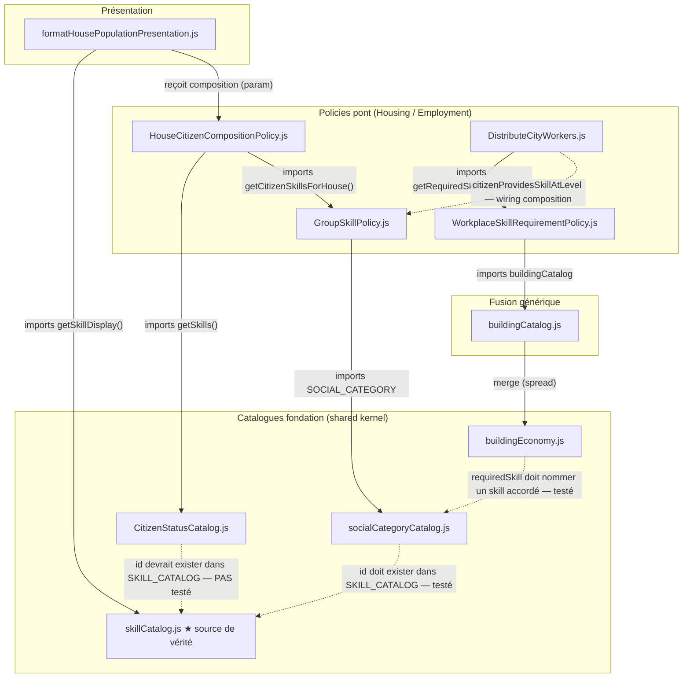

# Vocabulaire des compétences (skills) — schéma de dépendances entre catalogues

**Date**: 2026-09-10
**Status**: ✅ Implémenté

## Contexte

Un skill de citoyen (`fermier`, `spiritual`, `medical`, …) n'est jamais déclaré à un seul endroit : il est
**accordé** par un catalogue, **requis** par un autre, et **affiché** par un troisième — reliés uniquement par
le fait d'utiliser la même chaîne d'id. Rien n'importait ces catalogues entre eux pour vérifier que le
vocabulaire restait cohérent.

Deux bugs concrets sont venus de cette absence de source unique :

1. Le skill `spiritual` (ajouté à `socialCategoryCatalog.js` pour débloquer la Chapelle dès la tier 1) n'apparaissait
   jamais dans le panneau d'info maison — le dictionnaire de présentation `SKILL_PRESENTATION` avait sa propre
   liste, dupliquée à la main, jamais mise à jour.
2. Le panneau d'info de la Chapelle affichait le contenu du Marché — `classifySupplyKind()` ne distinguait pas un
   distributeur "flag" (Chapelle, École, Médecin…) d'un distributeur "quantity" (Marché), un problème différent
   mais du même ordre : une dérivation trop grossière plutôt qu'une correspondance déclarative précise. Voir
   `GetBuildingSupplyView.js` / `resolveBuildingInfoGroup.js`.

`skillCatalog.js` (`shared/population/`) a été introduit comme **la** source de vérité pour l'affichage d'un
skill (label, emoji) — ce document trace tous les liens restants : lesquels sont de vrais imports de code,
lesquels ne sont qu'une convention de nommage tenue par un test de contrat.

## Schéma

**Lecture** : haut → bas = qui dépend de qui (une flèche part de l'importeur, pointe vers ce qu'il importe).
Trait plein = `import` réel (direct ou câblé via la composition). Trait pointillé = même chaîne d'id utilisée
des deux côtés, **sans aucun import** — valide uniquement parce qu'un test vérifie que les deux catalogues
restent d'accord.

## Les 3 liens en pointillé, en détail

| Lien | Qui vérifie | Test |
|---|---|---|
| `socialCategoryCatalog.js` → `skillCatalog.js` | tout skill accordé par un tier a une entrée `SKILL_CATALOG` | `tests/presentation/dom/info/formatHousePopulationPresentation.test.js` (test "contract") |
| `buildingEconomy.js` → `socialCategoryCatalog.js` | tout `employment.requiredSkill` correspond à un skill réellement accordé quelque part | `tests/contexts/employment/workplaceSkillRequirementPolicy.test.js` (test "contract") |
| `CitizenStatusCatalog.js` → `skillCatalog.js` | les ids de statut (`governance`, `administration`, `elder-wisdom`, `learning`, `employment-eligible`) devraient aussi résoudre dans `SKILL_CATALOG` | **aucun** — écart identifié en dessinant ce schéma, pas encore couvert |

Le 3ᵉ lien est un vrai trou : `skillCatalog.js` contient bien ces 5 entrées aujourd'hui (copiées à la main
depuis l'ancien `SKILL_PRESENTATION`), mais rien n'empêche `CitizenStatusCatalog.js` de dériver et de casser
silencieusement l'affichage, exactement comme `spiritual` l'a fait avant ce refactor. Un test symétrique au
premier lien du tableau (itérer les skills de `CITIZEN_STATUS_PROFILES`, vérifier une entrée `SKILL_CATALOG`
pour chacun) fermerait cet écart.

## Référence des modules

| Module | Répertoire | Rôle |
|---|---|---|
| `skillCatalog.js` ★ | `shared/population/` | skill id → `{ label, emoji }`. Rien d'autre ne déclare l'affichage. |
| `socialCategoryCatalog.js` | `shared/population/` | par groupe social, par tier : `requirements` pour l'atteindre + `skills` (avec niveau) qu'il accorde. |
| `CitizenStatusCatalog.js` | `shared/population/` | par statut de citoyen (hunter-gatherer, worker, elite…) : skills, duties, rights. Voir `citizen-skills-duties-rights.md`. |
| `buildingEconomy.js` | `shared/asset-economy/` | par type de bâtiment : prix, besoins en emploi, et le skill (+ niveau) requis pour l'embauche. |
| `buildingCatalog.js` | `shared/building-catalog/` | fusionne `buildingEconomy.js` avec les catalogues nature/terrain — générique, ne nomme aucun thème. |
| `GroupSkillPolicy.js` | `housing/domain/policies/` | union des tiers d'une maison jusqu'à son niveau, renvoie le niveau max détenu par skill. |
| `HouseCitizenCompositionPolicy.js` | `housing/domain/policies/` | population + skills d'une maison → comptages prêts à afficher. |
| `WorkplaceSkillRequirementPolicy.js` | `employment/domain/policies/` | lit le skill + niveau requis d'un bâtiment directement depuis le catalogue. |
| `DistributeCityWorkers.js` | `employment/application/commands/` | la jointure mensuelle : bassin de main-d'œuvre (par skill + niveau) contre la demande des postes (par skill + niveau). |
| `formatHousePopulationPresentation.js` | `presentation/dom/info/population/` | liste tous les skills que la composition d'une maison détient réellement, ordonnés et libellés depuis `skillCatalog.js`. |

## Voir aussi

- [`shared-kernel-population.md`](./shared-kernel-population.md) — décision d'origine du shared kernel `shared/population/`.
- [`citizen-skills-duties-rights.md`](./citizen-skills-duties-rights.md) — modèle skills cumulatifs de `CitizenStatusCatalog.js`.
