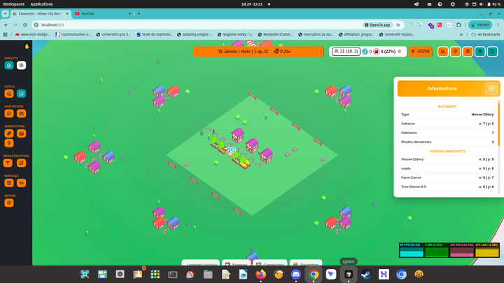

# Règle métier (Employment bounded context)

À chaque tour de redistribution (mensuel), le bounded context **Employment** remplit les bâtiments qui peuvent employer des travailleurs à partir de la main-d'œuvre disponible dans les maisons.

---

## 1. Population : citoyens, élites, total

### 1.1 Persistance (`pop` en base)

- **`pop`** = population **totale** d’une maison = **citoyens + élites**.
- Les **élites mangent** : la consommation alimentaire s’applique à `pop` entier (élites incluses).
- Seules les maisons avec **`roadCount > 0`** contribuent aux agrégats ville (pool, barre d’état).

### 1.2 Maisons ordinaires

- Toute la `pop` est **citoyenne** (ouvriers éligibles).
- Capacité : **6** citoyens max (`pop` max = 6).
- Élites : **0**.

### 1.3 Palais (`House-2Story`)

- Jusqu’à **6 citoyens** (ouvriers éligibles).
- Les **élites s’ajoutent** : à l’évolution Purple → Palais, `pop` passe de **6 à 7** (+1 élite, les 6 citoyens sont conservés).
- Capacité totale actuelle : **7** (`6 citoyens + 1 élite`).
- Formules (maison avec route) :
  - `citoyens` = `pop − max(0, pop − 6)`
  - `élites` = `max(0, pop − 6)` *(additives, au-delà du cap citoyen)*

### 1.4 Affichage barre d’état

Format : **`total (citoyens, élites)`**

- `total` = `workerPool + elitePool` *(population des maisons desservies)*
- `citoyens` = `workerPool`
- `élites` = `elitePool`

Exemple : **`21 (18, 3)`** = 21 habitants dont 18 citoyens ouvriers et 3 élites.

---

## 2. Pool ouvrier vs pool élite

| Métrique | Définition | Utilisation |
|---|---|---|
| **`workerPool`** | Σ citoyens des maisons avec route | Redistribution `employees.worker`, chômage ouvrier |
| **`elitePool`** | Σ élites des palais avec route | Affichage ; futur chômage élite *(à faire)* |
| **`totalPopulation`** | `workerPool + elitePool` | Affichage total |

Règles strictes :

- Les **élites ne prennent pas** les postes `worker` (`workerNeed` / `employees.worker`).
- Les **élites ne sont pas comptées** dans le pool ouvrier ni dans le chômage classique.
- La redistribution mensuelle (`DistributeCityWorkers`) ne consomme que le **`workerPool`**.

---

## 3. Postes à pourvoir

- Un **poste ouvrier** est un bâtiment **non-maison**, **non-route**, avec `workerNeed > 0` et `roadCount > 0`.
- `employees.worker` / `workerNeed` décrivent le staffing **ouvrier** uniquement.
- Les postes `elite_need` / `employees.elite` existent en config mais ne sont **pas encore alimentés** depuis `elitePool` *(chômage élite distinct — à faire)*.

### 3 bis. Éligibilité « manque » (no-road)

- Un poste sans route (`roadCount <= 0`) est **ignoré** pour le manque global et les icônes `no-work`.
- Tant que les seuls déficits concernent des bâtiments non routés, le chiffre **manque** reste à **0**.

---

## 4. Redistribution (gloutonne par priorité)

1. Réinitialiser tous les postes : `employees.worker = 0` (conserver `workerNeed`, `sector`).
2. Trier les postes par **priorité de secteur** (1 = la plus haute).
3. Pour chaque poste éligible (avec route) :
   - affecter `min(besoin restant, pool restant)`
   - ne jamais dépasser `workerNeed`
   - s’arrêter quand le pool ouvrier est épuisé.

---

## 5. Chômage ouvrier vs manque global

Deux métriques **indépendantes** — ne pas les confondre.

### 5.1 Chômage classique (surplus de main-d’œuvre)

Mesure les **citoyens ouvriers non assignés**, pas les postes vacants.

```
totalAssigned = Σ employees.worker   (postes éligibles, avec route)
unemployed    = max(0, workerPool − totalAssigned)
unemploymentPercentage = round(unemployed / workerPool × 100)   si workerPool > 0, sinon 0
```

- **Numérateur** : citoyens sans emploi ouvrier.
- **Dénominateur** : **`workerPool` uniquement** — les élites sont **exclues**.
- Affichage barre : **`unemployed (unemploymentPercentage %)`** — ex. `4 (22 %)`.

### 5.2 Manque global (déficit sur les postes)

Mesure les **postes ouvriers non pourvus** alors qu’ils sont éligibles.

```
lack = Σ max(0, workerNeed − employees.worker)   (postes éligibles, avec route)
```

- Affichage : chiffre rouge seul (ex. `0`), sans icône.
- Un manque > 0 déclenche les icônes **`no-work`** sur les bâtiments concernés.

### 5.3 Les deux peuvent coexister

| Situation | Chômage | Manque | Exemple |
|---|---|---|---|
| Plus d’ouvriers que de postes | > 0 | 0 | 18 citoyens, 14 emplois pourvus → `4 (22 %)`, manque `0` |
| Plus de postes que d’ouvriers | 0 | > 0 | 10 citoyens, 15 postes → chômage `0`, manque `5` |
| Pool épuisé, postes restants | > 0 | > 0 | Rare en pratique après redistribution gloutonne |

### 5.4 Exemple vérifié (partie réelle)

Capture du modèle en jeu — barre d’état et détail d’un palais (`pop = 7`) :

<figure>
  <a href="assets/employment_model.png" title="Ouvrir la capture en pleine résolution (1920×1080)">
    
  </a>
  <figcaption>
    <strong>Barre d'état</strong> : population <code>21 (18, 3)</code> · chômage ouvrier <code>4 (22 %)</code> · manque <code>0</code>.
    <strong>Panel</strong> : palais sélectionné, <code>pop = 7</code> (6 citoyens + 1 élite).
    · <a href="assets/employment_model.png">Agrandir la capture</a> (1920×1080)
  </figcaption>
</figure>

3 palais (`pop = 7` chacun) + 4 fermes (`workerNeed = 3`) + 1 marché (`workerNeed = 2`), tout routé :

| Métrique | Calcul | Valeur |
|---|---|---|
| Citoyens (`workerPool`) | 3 × 6 | **18** |
| Élites (`elitePool`) | 3 × 1 | **3** |
| Total | 18 + 3 | **21** → affichage `21 (18, 3)` |
| Emplois pourvus (`totalAssigned`) | 4×3 + 1×2 | **14** |
| Chômeurs (`unemployed`) | 18 − 14 | **4** |
| Taux chômage | round(4 / 18 × 100) | **22 %** → affichage `4 (22 %)` |
| Manque (`lack`) | tous postes pourvus | **0** |

---

## 6. Chômage élite *(à faire)*

- Métrique **distincte** du chômage ouvrier.
- Basée sur `elitePool` et les postes `elite_need` / `employees.elite`.
- N’entre **pas** dans `unemploymentPercentage` ni dans le garde-fou immigration §7.2.

---

## 7. Immigration *(à faire)*

L’immigration est pilotée par le **taux d’attractivité**, sous réserve des blocages ci-dessous.

### 7.1 Taux d’attractivité *(à faire)*

- Valeur normalisée (ex. 0–100 %).
- Immigration mensuelle = fonction du taux ; à 0, pas d’immigration par attractivité seule.
- Facteurs hors Employment (qualité de vie, services, etc.) — **à préciser**.
- Entrée Employment : `unemploymentPercentage` (chômage **ouvrier** uniquement).

### 7.2 Blocage si chômage ouvrier > 10 % *(à faire)*

- Si `unemploymentPercentage` **> 10 %**, l’immigration **cesse**.
- Tant que chômage ouvrier **≤ 10 %**, immigration possible selon attractivité et autres contraintes (logements, capacité maisons, etc.).

---

## Référence technique

Read model unique : `GetCityEmploymentSummary` →  
`{ workerPool, elitePool, totalPopulation, totalAssigned, unemployed, unemploymentPercentage, lack, understaffedBuildingIds, bySector }`

Policy population : `LaborPoolPolicy` (`citizenPopFromHouse`, `elitePopFromHouse`, `workerPopFromHouse`).
